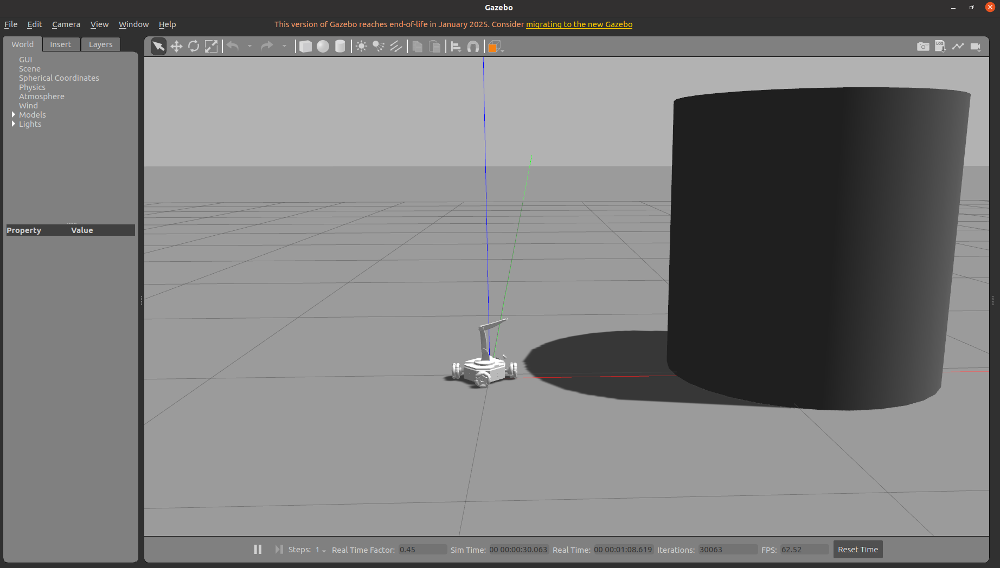
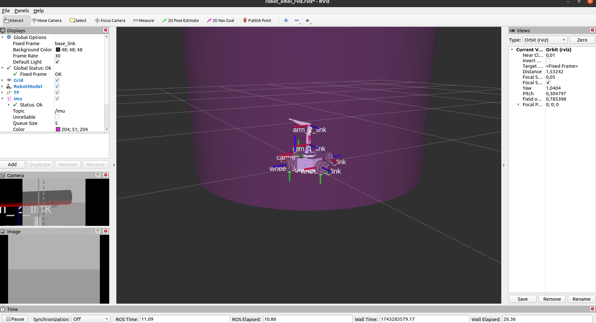
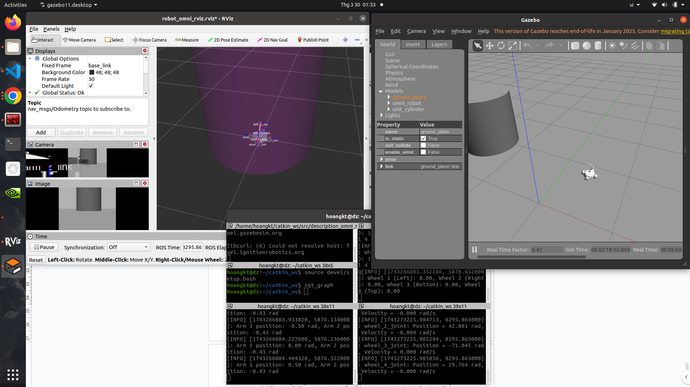

# Mô Phỏng Robot Omni 4 Bánh với Gazebo và RViz

## Tổng Quan
Dự án này mô phỏng một robot omni-directional 4 bánh trong môi trường **Gazebo**, tích hợp với **RViz** để trực quan hóa. Robot có thể được điều khiển thông qua bàn phím, bao gồm cả chuyển động của bánh xe và tay máy (*robotic arm*). Ngoài ra, hệ thống cũng hỗ trợ hiển thị dữ liệu từ **encoder**.

## Yêu Cầu Cần Thiết
- **ROS Noetic** (hoặc phiên bản ROS tương thích)
- **Gazebo** (phiên bản hỗ trợ ROS)
- **RViz**

Trước khi chạy, hãy đảm bảo bạn đã *source* không gian làm việc ROS:

```bash
source devel/setup.bash
```

---

## Hướng Dẫn Sử Dụng
### 1. Khởi động Gazebo cùng RViz
```bash
roslaunch description_omni_robot gazebo.launch
```



### 2. Cấp quyền thực thi cho các file điều khiển
```bash
chmod +x controlKeyboard.py
chmod +x arm_control.py
chmod +x display_encoders.py
```

### 3. Điều khiển bánh xe thông qua bàn phím
```bash
rosrun description_omni_robot controlKeyboard.py
```

### 4. Điều khiển tay máy (*robotic arm*)
```bash
rosrun description_omni_robot arm_control.py
```

### 5. Hiển thị dữ liệu từ encoder
```bash
rosrun description_omni_robot display_encoders.py
```
### 6. Result


---

## Ghi Chú
- Đảm bảo rằng các package và dependency cần thiết đã được cài đặt đầy đủ.
- Nếu gặp lỗi liên quan đến quyền thực thi, hãy kiểm tra lại với `ls -l` và cấp quyền bằng `chmod`.
- Nếu có lỗi khi chạy `rosrun`, hãy kiểm tra xem `ROS_PACKAGE_PATH` đã được thiết lập đúng hay chưa.

---
**Chúc bạn mô phỏng thành công! 🚀**

